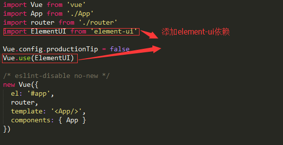

# vue.js安装

1. 使用node.js构建方式，执行如下命令按照vue-cli工具
   * npm i vue-cli -g
2. 创建新项目demo1
   * vue init webpack demo1
   * 创建过程中问题回答：
     * Project name (demo1) 项目名称，直接回车确定使用demo1作为项目名称
     * Project description (A Vue.js project) 项目描述，输入“vue学习项目”，回车
     * Author 作者直接回车确定
     * Vue build (Use arrow keys) 开始vue项目构建， 回车确定
     * Install vue-router? (Y/n) 是否使用vue-router，输入Y，回车
     * Use ESLint to lint your code? (Y/n) 是否使用ESLint检查你的代码，输入n，回车
     * Setup unit tests with Karma + Mocha? (Y/n) 是否使用Karma+Mocha来进行单元测试，输入n，回车
     * Setup e2e tests with Nightwatch? (Y/n)  是否使用Nightwatch进行端对端测试，输入n，回车
3. 安装依赖命令
   * ​cd demo1
   * npm install
4. 启动项目
   * npm run dev
     此时浏览器访问http://localhost:8080地址即可查看新建的vue项目
# 引入element-ui
1. 在demo1目录下打开命令行工具，执行npm i element-ui -S，添加element-ui依赖

2. 打开src目录下的main.js，添加element-ui依赖到项目中，如下图：

   
3. 打开根目录下的index.html文件，在head标签对中添加css依赖
   * &lt:link rel="stylesheet" href="https://unpkg.com/element-ui/lib/theme-default/index.css"/&gt;
4. 检查依赖是否成功：打开src/components目录下的Hello.vue文件，在template标签对中加入一个&lt:el-button&gt;按钮&lt:/el-button&gt;，然后在命令行输入npm run dev运行项目，访问http://localhost:8080查看是否出现了一个button按钮，如果看到则表示引入成功